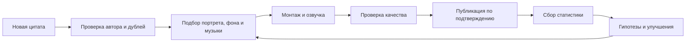

# 🤖 GPTAUTO ЦИТ — центр управления

> Операционная база конвейера видеоцитат для TikTok, YouTube Shorts и Instagram Reels.

## 🎯 Цель

Создавать вертикальные ролики 1080×1920 из цитаты, портрета автора, постоянной фигуры, фона, музыки и единого голоса. После публикации собирать аналитику и улучшать следующие ролики на основании повторяющихся паттернов.

## 📍 Рабочие пути

| Назначение | Путь |
| --- | --- |
| Исходные материалы | `C:\Users\reddo\Desktop\GPTAUTO ЦИТ` |
| Новые цитаты | `C:\Users\reddo\Desktop\GPTAUTO ЦИТ\ЦИТАТЫ` |
| Использованные цитаты | `C:\Users\reddo\Desktop\GPTAUTO ЦИТ\ЦИТАТЫ ИСП` |
| Музыка | `C:\Users\reddo\Desktop\GPTAUTO ЦИТ\МУЗЫКА` |
| Фоны | `C:\Users\reddo\Desktop\GPTAUTO ЦИТ\ФОНЫ` |
| Портреты авторов | `C:\Users\reddo\Desktop\GPTAUTO ЦИТ\АВТОРЫ` |
| Постоянная фигура | `C:\Users\reddo\Desktop\GPTAUTO ЦИТ\ЦИТ.png` |
| Рабочие проекты | `C:\Users\reddo\Desktop\GPTAUTO ЦИТ\ПРОЕКТЫ` |
| Готовый экспорт | `C:\Users\reddo\Desktop\GPTAUTO ЦИТ\ЭКСПОРТ` |
| Архив | `C:\Users\reddo\Desktop\GPTAUTO ЦИТ\АРХИВ` |
| Технические логи | `C:\Users\reddo\Desktop\GPTAUTO ЦИТ\ЛОГИ` |

## 🔄 Производственный поток

## 🧭 Навигация

- [[📐 Спецификация ролика]]
- [[🗂️ Очередь цитат]]
- [[📦 Реестр видео]]
- [[🧪 Гипотезы и паттерны]]
- [[🔌 Доступы и автоматизация]]
- [[🧾 Журнал работы]]

## ⚡ Следующие действия

- [ ] Проверить доступ к закрытой аналитике трёх студий
- [ ] Выбрать постоянный голос диктора
- [ ] Подтвердить права на использование музыкальных треков
- [ ] Создать тестовый ролик из следующей цитаты без публикации
- [ ] После проверки настроить управляемую публикацию
